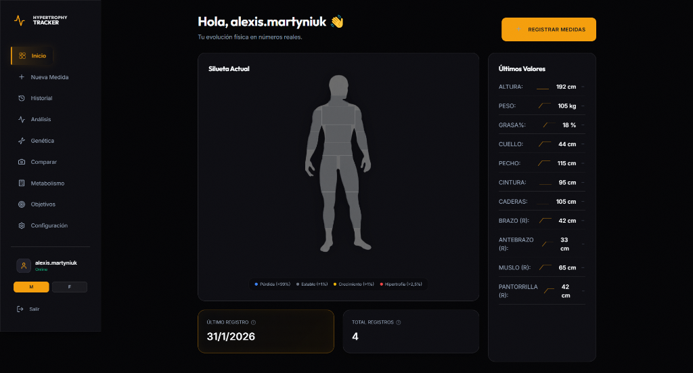
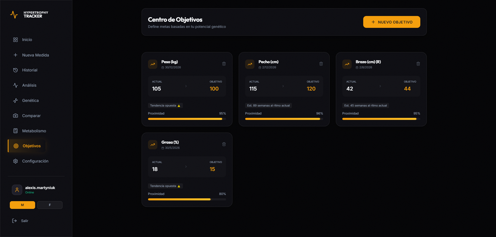

# Presentación Oficial: Hypertrophy Tracker 🏋️‍♂️

Este documento contiene el material visual y narrativo para la exposición del proyecto en redes sociales y entornos profesionales.

## 🚀 Concepto: "Inteligencia Táctica para tu Cuerpo"

**Hypertrophy Tracker** no es solo una app de medidas; es un sistema HUD (Head-Up Display) de grado táctico para atletas que buscan precisión absoluta en su transformación física.

---

## 📸 Galería Promocional

### 1. Dashboard de Control Maestro

*Visualización HUD 100% real con el heatmap dinámico de progresión.*

### 2. Auditoría Corporal Interactiva

*Interfaz táctica para el registro preciso de perímetros corporales.*

### 3. Centro de Inteligencia y Objetivos

*Monitoreo de metas basado en datos y potencial genético real.*

---

## 🛠️ Highlights Tecnológicos

- **React 19 + TypeScript:** Arquitectura moderna y ultra-rápida.
- **Firebase Firestore (Always-On):** Base de datos documental NoSQL siempre activa 24/7 sin suspensiones por inactividad.
- **Skeletal Analysis:** Algoritmos de Casey Butt para predecir tu potencial genético real.
- **Calculadora Metabólica:** Algoritmos Mifflin-St Jeor y Katch-McArdle para control energético.
- **PWA Nativa:** Instalable en iOS/Android directamente desde el navegador para uso sin conexión en el gimnasio.

---

## 💡 Mensaje para Redes (Copy sugerido)

> "¿Cansado de trackers básicos o bases de datos lentas? He construido **Hypertrophy Tracker**, una herramienta HUD premium para llevar mi progreso físico al siguiente nivel. Con heatmap de crecimiento muscular, análisis de potencial genético, calculadora metabólica y sincronización en la nube 24/7. 🚀💪 #FitnessTech #BuildInPublic #HypertrophyTracker #React #Firebase"

---

*Nota: Este material está listo para ser copiado y pegado en LinkedIn, Twitter o tu portafolio personal.*
