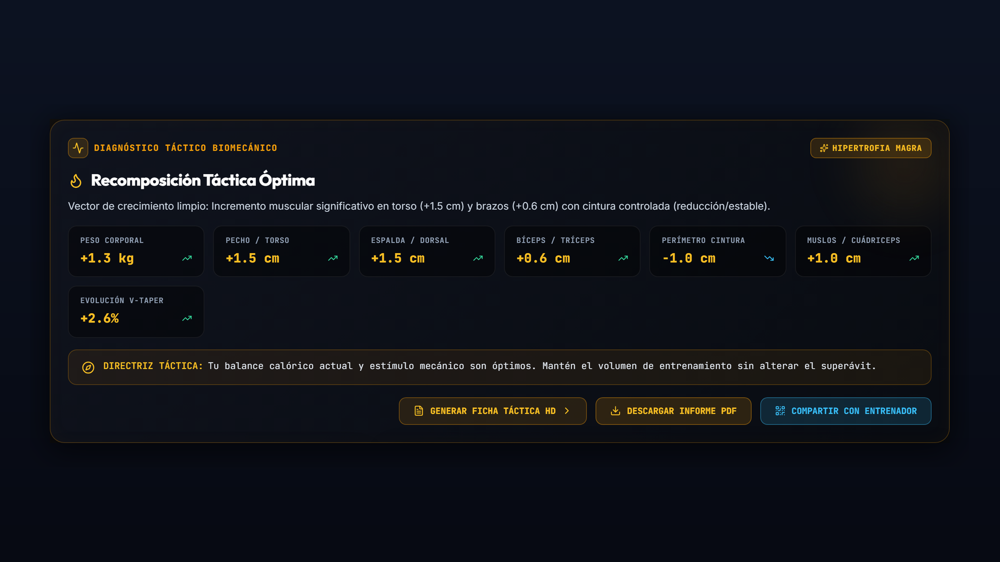
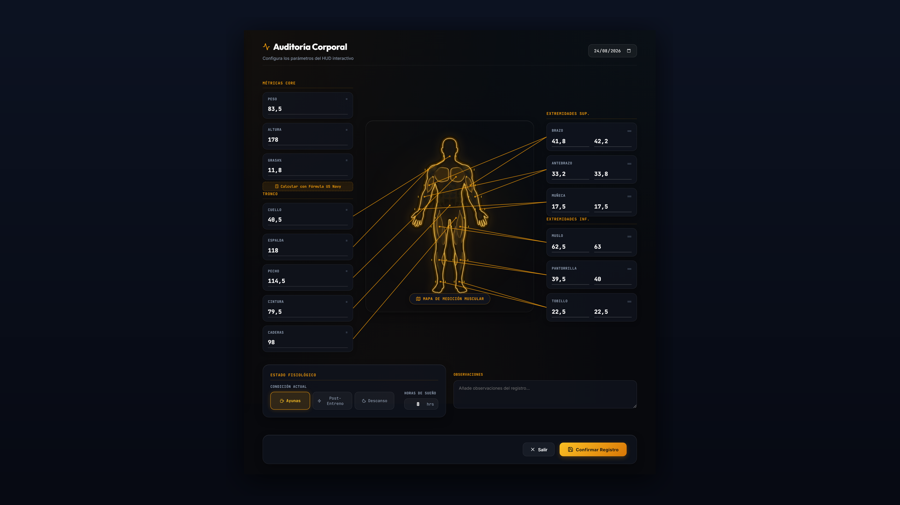
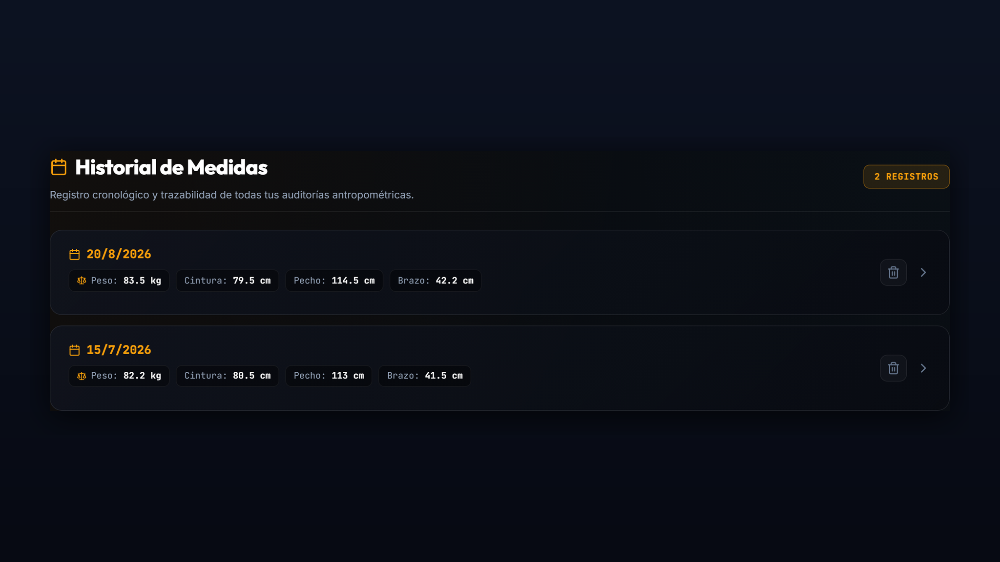
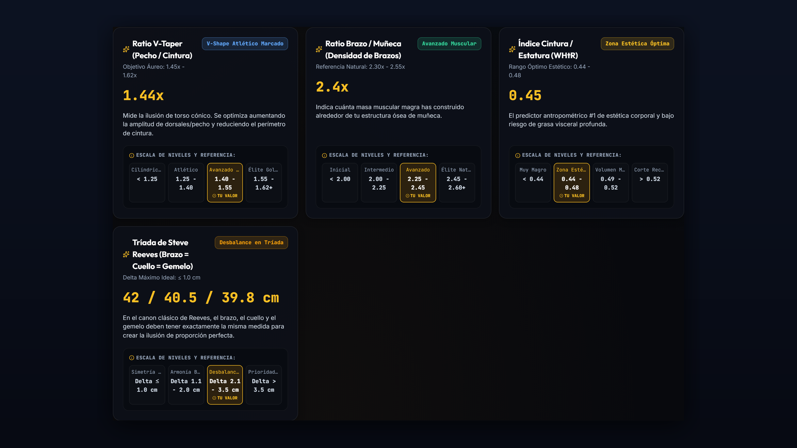
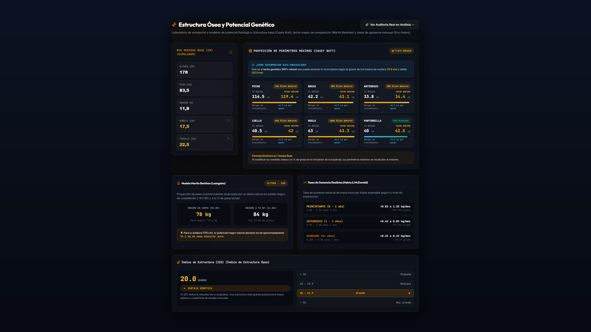
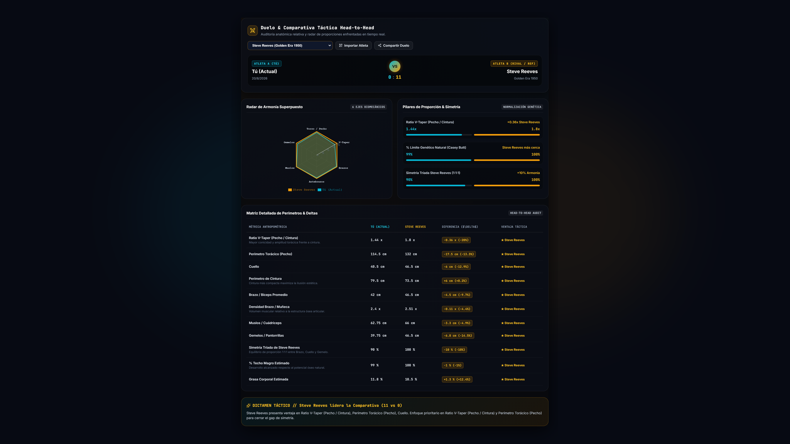

# Hypertrophy Tracker — Premium Body Analytics & Tactical Biometrics 🏋️‍♂️⚡

[](https://www.alexismartyniuk.com.ar/hypertrophyracker)
[](https://react.dev/)
[](https://www.typescriptlang.org/)
[](https://firebase.google.com/)
[-purple.svg?style=flat&logo=pwa)](https://web.dev/progressive-web-apps/)

> **Hypertrophy Tracker** es una plataforma de telemetría y análisis corporal de alto rendimiento diseñada para culturistas naturales y atletas de fuerza. No es un simple bloc de notas: es un **centro de diagnóstico táctico** inspirado en interfaces militares HUD (*Head-Up Display*), impulsado por modelos científicos de biomecánica, proporciones áureas clásicas y algoritmos de prescripción de volumen.

🌐 **Demo en Vivo Oficial:** [https://www.alexismartyniuk.com.ar/hypertrophyracker](https://www.alexismartyniuk.com.ar/hypertrophyracker)

---

## 🌟 Módulos y Capacidades Principales

### 1. ⚔️ Simulador Táctico "Versus" (Head-to-Head Duel)
Enfrenta tu físico en tiempo real contra **18 figuras históricas del culturismo y celebridades de Hollywood en su *prime*** clasificadas por categorías:
- 🏛️ **Leyendas de Oro & Estética Clásica:** *Steve Reeves (1950), Frank Zane (1979), Serge Nubret (1975), Bob Paris (1984), John Grimek (1948), Eugen Sandow (1894)*.
- 💥 **Poder, Masa & Densidad:** *Arnold Schwarzenegger (1974), Reg Park (1958), Franco Columbu (1976), Tom Platz (1981)*.
- 🎬 **Íconos del Cine & Celebridades:** *Sylvester Stallone (Rambo II 1985), Henry Cavill (Man of Steel 2013), Dwayne "The Rock" Johnson (Hercules 2014), Brad Pitt (Fight Club 1999), Hugh Jackman (The Wolverine 2013), Jean-Claude Van Damme (Bloodsport 1988)*.
- ⚡ **Definición & Calistenia Funcional:** *Bruce Lee (Enter the Dragon 1973)*.
- 🛡️ **Era Moderna (Classic Physique):** *Chris Bumstead / CBum (2023)*.
- 👑 **Heroínas del Cine & Fitness Femenino:** *Cory Everson (1985), Linda Hamilton (Terminator 2 1991), Brooke Ence (CrossFit Games 2015), Jessica Biel (Blade: Trinity 2004), Gal Gadot (Wonder Woman 2017), Natalie Portman (The Mighty Thor 2022)*.

**Incluye:**
- Radar biomecánico dual de 6 ejes (*Pecho, V-Taper, Brazos, Antebrazos, Muslos, Gemelos*).
- Matriz comparativa con **15 métricas de combate competitivas** y datos basales neutrales.
- Dictamen táctico generado por IA analítica.

---

### 2. 🧬 Modelos Fisiológicos & Algoritmos Científicos
- **Límites Óseos Naturales (Casey Butt):** Proyección del perímetro máximo por grupo muscular a partir del grosor articular de muñecas, tobillos y rodillas.
- **Techo Magro de Competición (Martin Berkhan / Leangains):** Estimación de masa muscular máxima con 5-6% de grasa corporal.
- **FFMI Normalizado (Kouri et al.):** Índice de masa libre de grasa ajustado a 1.80m de altura estándar con escala de desarrollo muscular natural.
- **Cánones Estéticos Clásicos:**
  - **Tríada de Steve Reeves (1:1:1):** Equilibrio y simetría de volumen entre Brazo, Cuello y Gemelo.
  - **Índice Adonis:** Ratio 1.618x (V-Taper Pecho / Cintura).
  - **Ratio Cintura / Altura (WHtR):** Control de esbeltez y salud metabólica (< 0.45).
- **Tasas de Ganancia Mensual (Eric Helms):** Estimación de ritmo de hipertrofia realista según nivel de entrenamiento (*Principiante, Intermedio, Avanzado*).

---

### 3. 🎯 Motor de Prescripción de Entrenamiento & Volumen
- Diagnóstico automático de grupos musculares rezagados vs dominantes.
- Algoritmo de ajuste de volumen semanal efectivo (series semanales por grupo).
- Asignación de rango de repeticiones y selección de ejercicios prioritarios y de aislamiento.

---

### 4. 🔥 Mapa de Calor Visceral (Dynamic Heatmap)
Visualización inmediata en la silueta anatómica comparando la sesión actual con el registro previo:
- **Rojo Intenso:** Hipertrofia significativa (> +2.5%).
- **Amarillo / Ámbar:** Crecimiento sostenido (+1.0% a +2.5%).
- **Gris HUD:** Estabilidad o mantenimiento perfecto.
- **Azul Neón:** Definición o reducción de perímetro (< -1.0%).

---

### 5. ⚡ Calculadora Metabólica Integral
- Fórmulas **Mifflin-St Jeor**, **Katch-McArdle** y **Harris-Benedict**.
- Cálculo de NEAT, gasto calórico activo por sesión de entrenamiento y TDEE total.
- Distribución de macronutrientes optimizada para fases de *Volumen Limpio*, *Mantenimiento* o *Déficit Agresivo*.

---

### 6. 🏆 Vitrina de Trofeos & Gamificación Táctica
- Sistema de **18 insignias y trofeos fisiológicos** desbloqueables por hitos reales (ej. *Tríada de Reeves al 95%*, *V-Taper Áureo*, *Club de los 40cm de Bíceps*, *Racha de Registros Longitudinales*).

---

### 7. 📱 Arquitectura Serverless Always-On & PWA Offline-First
- **Firebase Firestore (JSON NoSQL) & Auth:** Sincronización en la nube 24/7 sin suspensiones por inactividad.
- **Modo Offline-First:** Service Worker con precaché de 56 recursos estáticos para operar dentro de vestuarios y subsuelos sin conexión.
- **Entrada Numérica Optimizada:** Formulario adaptado a pantallas táctiles con inputMode="decimal" y pasos de precisión de 0.1 cm.
- **Exportación & Privacidad:** Informes PDF vectoriales listos para imprimir y enlaces públicos seguros cifrados en URL hash sin exponer credenciales.

---

## 🛠️ Stack Tecnológico

| Capa | Tecnologías |
| :--- | :--- |
| **Frontend Core** | [React 19](https://react.dev/) · [TypeScript 5.7](https://www.typescriptlang.org/) · [Vite 7](https://vitejs.dev/) |
| **Estilos & UI** | CSS Modules · Glassmorphism · CSS Grid & Flexbox · Lucide Icons |
| **Backend & Cloud** | [Firebase](https://firebase.google.com/) (Firestore NoSQL + Firebase Authentication) |
| **Manejo de Formularios** | [React Hook Form](https://react-hook-form.com/) · [Zod](https://zod.dev/) (Validación estricta de esquemas) |
| **Visualización & Gráficos** | [Recharts](https://recharts.org/) · SVG Dinámicos Vectoriales |
| **PWA & Offline** | [vite-plugin-pwa](https://vite-pwa-org.netlify.app/) · Workbox Service Worker |
| **Documentos & PDF** | [jsPDF](https://github.com/parallax/jsPDF) · [html2canvas](https://html2canvas.hertzen.com/) |
| **Internacionalización** | [i18next](https://www.i18next.com/) (Español / Inglés con detección automática) |

---

## 📸 Capturas del Sistema

| 1. Dashboard & Heatmap | 2. Registro Biométrico | 3. Historial Longitudinal |
| :---: | :---: | :---: |
|  |  |  |

| 4. Auditoría de Proporciones | 5. Límites de Casey Butt | 6. Duelo Táctico Versus |
| :---: | :---: | :---: |
|  |  |  |

---

## 🚀 Instalación y Despliegue Local

### 1. Clonar el repositorio:
```bash
git clone https://github.com/a-martyniuk/hypertrophy-tracker.git
cd hypertrophy-tracker
```

### 2. Instalar dependencias:
```bash
npm install
```

### 3. Configuración de Variables de Entorno:
Crea un archivo `.env` en la raíz del proyecto:
```env
VITE_FIREBASE_API_KEY=tu_api_key
VITE_FIREBASE_AUTH_DOMAIN=tu_proyecto.firebaseapp.com
VITE_FIREBASE_PROJECT_ID=tu_proyecto
VITE_FIREBASE_STORAGE_BUCKET=tu_proyecto.firebasestorage.app
VITE_FIREBASE_MESSAGING_SENDER_ID=tu_sender_id
VITE_FIREBASE_APP_ID=tu_app_id
```
*(Si no configuras Firebase, el sistema operará automáticamente en modo **Invitado / Offline Local** persistiendo en `localStorage`)*.

### 4. Servidor de desarrollo:
```bash
npm run dev
```

### 5. Compilación para producción:
```bash
npm run build
```

---

## 🎨 Filosofía de Diseño: "Tactical Amber HUD"
La interfaz está inspirada en sistemas tácticos de aviación y *Head-Up Displays* de alta tecnología:
- **Fondo:** `#070a13` (Negro carbón militar profundo).
- **Acentos:** `#fbbf24` (Ámbar táctico de alta visibilidad) y `#22d3ee` (Cian de telemetría).
- **Efectos:** Glassmorphism con `backdrop-filter: blur(12px)` y bordes translúcidos de 1px.

---

## 👤 Autor
Desarrollado con dedicación por **[Alexis Martyniuk](https://github.com/a-martyniuk)**  
🔗 Portfolio Profesional: [https://www.alexismartyniuk.com.ar](https://www.alexismartyniuk.com.ar)
