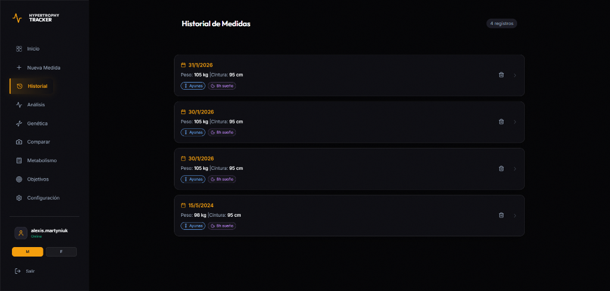
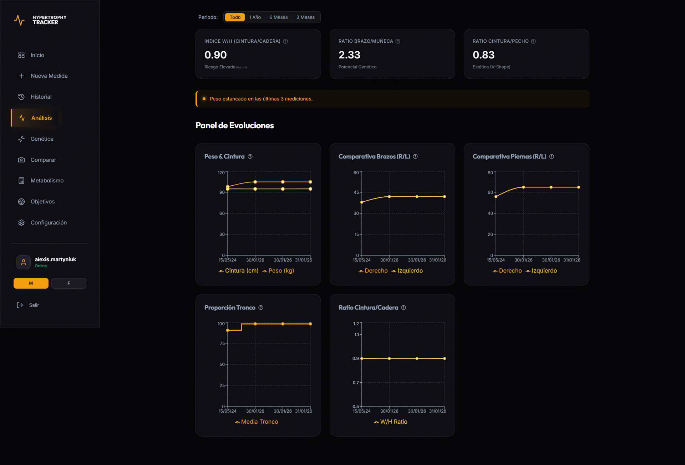
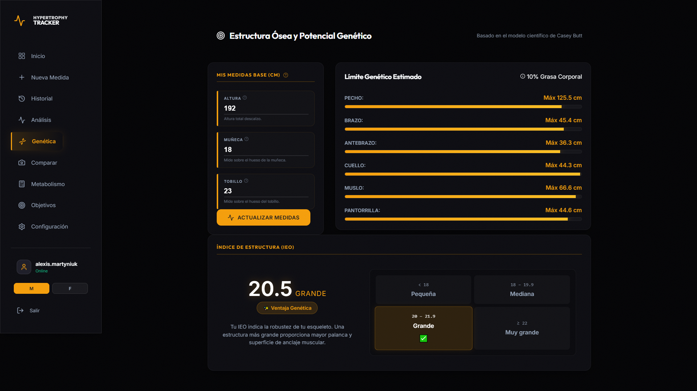
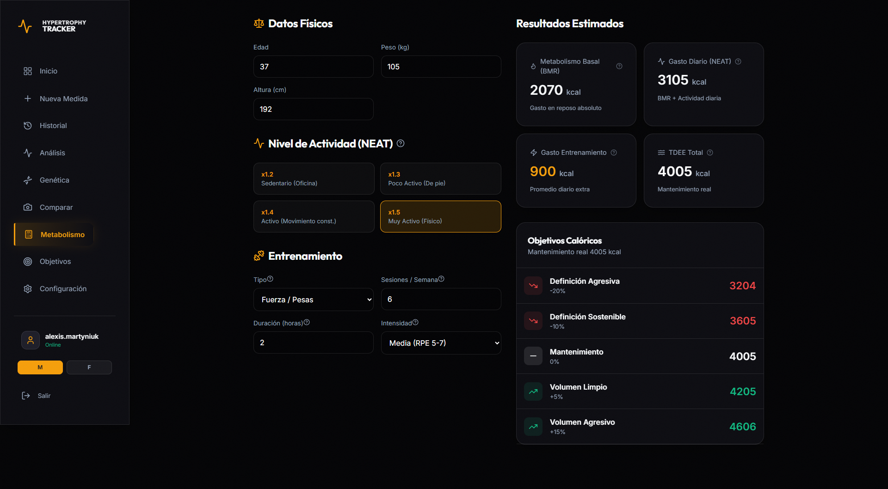

# Hypertrophy Tracker - Premium Body Analytics 🏋️‍♂️

[](https://hypertrophyracker.alexismartyniuk.com.ar/)
[](https://react.dev/)
[](https://firebase.google.com/)
[](https://web.dev/progressive-web-apps/)

**Hypertrophy Tracker** es una plataforma de análisis corporal de alto rendimiento diseñada para entusiastas del fitness y culturistas naturales. No es solo un log de medidas; es un centro de inteligencia táctica para monitorear cada milímetro de tu progreso físico con cero latencia y disponibilidad 24/7.

---

## 🌟 Características Destacadas

### 1. Mapa de Calor Visceral (Heatmap)
Visualiza tu progreso al instante. La silueta principal se tiñe dinámicamente comparando tu registro actual con el anterior.
- **Rojo:** Hipertrofia significativa (>2.5%).
- **Amarillo:** Crecimiento constante (>1%).
- **Azul:** Pérdida o definición (< -1%).
- **Gris:** Estabilidad perfecta.

### 2. Análisis del Potencial Genético (Casey Butt)
Implementa el modelo científico de **Casey Butt** para calcular tus límites naturales basados en tu estructura ósea (tobillos, muñecas y rodillas). 
- Cálculo del **IEO (Índice de Estructura Ósea)**.
- Estimaciones de peso máximo por porcentaje de grasa corporal.

### 3. Calculadora Metabólica Integral
Estimaciones avanzadas de Tasa Metabólica Basal (BMR) y Gasto Energético Diario Total (TDEE) mediante las fórmulas de **Mifflin-St Jeor**, **Katch-McArdle** y **Harris-Benedict**, con distribución personalizada de macronutrientes.

### 4. Mapa de Medición Muscular (Guía In-App)
Incluye un mapa anatómico interactivo que indica los puntos precisos para colocar la cinta métrica, garantizando coherencia longitudinal en los datos.

### 5. Arquitectura Serverless Always-On & PWA
- **Sincronización en la Nube 24/7:** Basado en **Firebase Firestore (JSON Documental)** y **Firebase Auth** (Google 1-click login o Email). Sin caídas ni suspensiones por inactividad.
- **Modo Invitado / Offline First:** Funciona de forma inmediata en local sin necesidad de registro previo.
- **Instalación Nativa:** Funciona como una **PWA** (Progressive Web App), instalable en iOS y Android para usar dentro del gimnasio.

---

## 🛠️ Stack Tecnológico

El proyecto utiliza una arquitectura moderna enfocada en la velocidad, simplicidad y experiencia de usuario:

- **Frontend:** [React 19](https://react.dev/) + [TypeScript](https://www.typescriptlang.org/) para un tipado robusto.
- **Build Tool:** [Vite 7](https://vitejs.dev/) + [vite-plugin-pwa](https://vite-pwa-org.netlify.app/) para una experiencia PWA nativa.
- **Backend / Cloud:** [Firebase](https://firebase.google.com/) (Firestore NoSQL + Firebase Auth).
- **Animaciones:** [Framer Motion](https://www.framer.com/motion/) para micro-interacciones fluidas.
- **Formularios & Estado:** [React Hook Form](https://react-hook-form.com/) + [Zod](https://zod.dev/) para validación estricta.
- **Internacionalización:** [i18next](https://www.i18next.com/) (Soporte completo ES/EN).
- **Visualización de Datos:** [Recharts](https://recharts.org/) y SVG dinámicos interactivos.

---

## 📸 Galería del Proyecto

Aquí puedes ver la interfaz "Premium Amber HUD":

| Dashboard & Heatmap | Auditoría Corporal (HUD) | Historial de Medidas |
| :---: | :---: | :---: |
|  |  |  |

| Análisis de Tendencias | Potencial Genético | Calculadora Metabólica |
| :---: | :---: | :---: |
|  |  |  |

---

## 🚀 Instalación y Desarrollo

1. **Clonar el repositorio:**
   ```bash
   git clone https://github.com/a-martyniuk/hypertrophy-tracker.git
   cd hypertrophy-tracker
   ```

2. **Instalar dependencias:**
   ```bash
   npm install
   ```

3. **Variables de Entorno:**
   Crea un archivo `.env` en la raíz (puedes guiarte con `.env.example`):
   ```env
   VITE_FIREBASE_API_KEY=tu_api_key
   VITE_FIREBASE_AUTH_DOMAIN=tu_proyecto.firebaseapp.com
   VITE_FIREBASE_PROJECT_ID=tu_proyecto
   VITE_FIREBASE_STORAGE_BUCKET=tu_proyecto.firebasestorage.app
   VITE_FIREBASE_MESSAGING_SENDER_ID=tu_sender_id
   VITE_FIREBASE_APP_ID=tu_app_id
   ```
   *(Si omites estas variables, la aplicación funcionará automáticamente en modo Local / Invitado).*

4. **Ejecutar en desarrollo:**
   ```bash
   npm run dev
   ```

5. **Compilar para producción:**
   ```bash
   npm run build
   ```

---

## 🎨 Filosofía de Diseño: "Premium Amber HUD"
La interfaz está inspirada en los *Head-Up Displays* tácticos, utilizando una paleta de colores **Amber/Dark** con efectos de **Glassmorphism**, desenfoque de fondo y líneas de escaneo para dar una sensación de herramienta profesional y de alta precisión.

---

Desarrollado con ❤️ por [Alexis Martyniuk](https://github.com/a-martyniuk)
